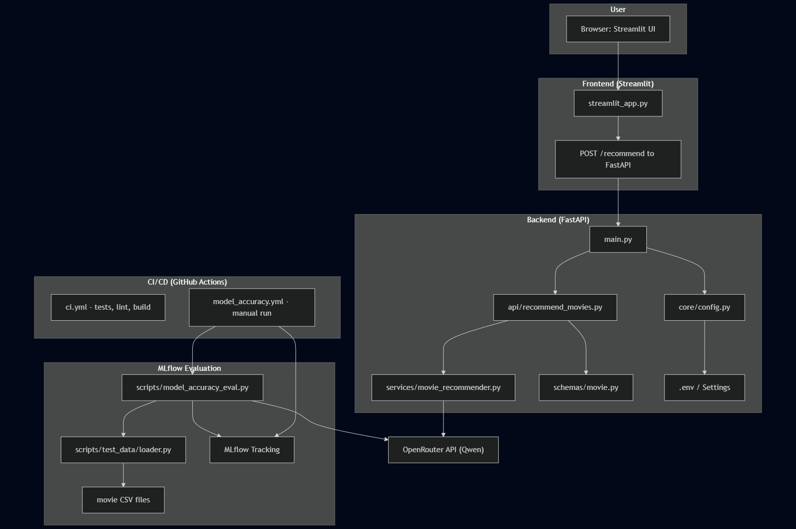

# 🎬 Movie Recommender Chatbox

An interactive AI app that suggests 🎥 movie titles based on a custom plot you enter, powered by large language models and a clean Streamlit frontend.

The system also scores how well each recommendation matches your plot, and displays poster images and IMDb links when available. Smart, stylish, and movie-buff friendly! 🍿


## 🧾 Features

- 🤖 LLM-based movie title suggestions
- 📊 Confidence scoring (0–100%)
- 🖼 Poster fetching from OMDb API
- 🌐 IMDb links for real movie titles
- ⚠️ Warnings for imaginary titles
- 🧠 Dropdown to choose between LLMs (Claude, Qwen)
- ✨ Polished UI with emojis and styled components


## 🤖 App architecture




## 🗂 Project Structure

```
ml-plot-retrieval-llm-chatbox/
│
├── app/                    # FastAPI backend
│   ├── api/                # Endpoint logic
│   ├── core/               # Configuration (settings)
│   ├── schemas/            # Request/response models
│   ├── services/           # LLM logic and OMDb interaction
│   ├── Dockerfile          # Backend Docker config
│   └── main.py             # Entrypoint for backend
│
├── frontend/               # Streamlit frontend
│   ├── streamlit_app.py    # UI logic
│   └── Dockerfile          # Frontend Docker config
│
├── docker-compose.yml      # Multi-service orchestration
├── .env                    # Environment config
├── requirements.txt
└── README.md
```


## ⚙️ Environment Variables

These should go in your **`.env`** file in the project root:

| Variable         | Description                                 | Required |
|------------------|---------------------------------------------|----------|
| `API_KEY`        | Your OpenRouter / LLM API key               | ✅       |
| `LLM_API_URL`    | Endpoint for chat completion                | ✅       |
| `OMDB_API_KEY`   | API key from [omdbapi.com](http://omdbapi.com) | ✅    |

Example `.env` file:

```
API_KEY=your_openrouter_key
LLM_API_URL=https://openrouter.ai/api/v1/chat/completions
OMDB_API_KEY=your_omdb_key
```


## 🚀 Getting Started

### 1. Build & Run with Docker

```
docker-compose up --build
```

This will:
- Launch the **FastAPI backend** on [http://localhost:8000](http://localhost:8000)
- Launch the **Streamlit frontend** on [http://localhost:8501](http://localhost:8501)


### 2. Check Health

```
curl http://localhost:8000/health
```

Expected:

```
{"status":"ok"}
```


## 🔌 Backend API

### POST `/recommend`

**Request:**

```
{
  "plot": "A young artist in a coastal village dreams of painting...",
  "model": "anthropic/claude-2"
}
```

**Response:**

```
{
  "suggestions": [
    {
      "title": "Waves of Imagination",
      "description": "A girl escapes grief through art at a lighthouse.",
      "score": 0.93
    },
    ...
  ]
}
```


## 🧠 Supported Models

You can choose from the dropdown:

- `anthropic/claude-2`
- `qwen:7b`
- `qwen:14b`

These are passed to the backend and used when prompting the LLM.


## 🧼 Cleanup

To stop all services:

```
docker-compose down
```

To clean images and unused resources:

```
docker system prune -af
```

---

## 🙌 Acknowledgements

- 🤖 [OpenRouter.ai](https://openrouter.ai) – LLM provider
- 🧠 [Anthropic Claude](https://www.anthropic.com/index/claude)
- 🧠 [Qwen Models](https://huggingface.co/Qwen)
- 🎞️ [OMDb API](http://www.omdbapi.com/)
- ⚡ [FastAPI](https://fastapi.tiangolo.com)
- 🎨 [Streamlit](https://streamlit.io)


## 💡 Future Ideas

- 🎛 Toggle to hide imaginary movies
- ⭐ User rating or feedback per suggestion
- 🌐 Multi-language plot support
- 🎬 TMDb or JustWatch integration for deeper movie data

---


